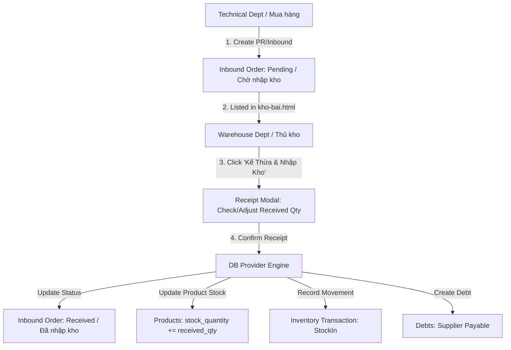

# System Design Specification: Purchase Request (PR) & Supplier Inbound Warehouse Inheritance Workflow

**Date**: 2026-08-11  
**Target Module**: Warehouse Management (`kho-bai.html`, `inventory.js`), Database Provider (`js/supabase-client.js`), Debt Management (`cong-no.html`)

---

## 1. Executive Summary & Objective

The objective of this feature is to establish a structured purchasing and warehouse receipt workflow:
- **Technical Department (Bộ phận Kỹ thuật)** creates Purchase Requests (PR) / Inbound Orders from Suppliers, specifying requested items, expected quantities, and estimated cost prices. These orders enter the system in a **`Pending` (Chờ nhập kho)** state.
- **Warehouse Department (Bộ phận Kho)** views the list of pending Inbound orders directly within `kho-bai.html`, inherits the document, verifies or adjusts the actual received quantities, and confirms the receipt.
- Upon receipt confirmation, the system automatically:
  1. Updates the Inbound Order status to **`Received` (Đã nhập kho)**.
  2. Increases the inventory quantity (`stock_quantity`) of each received product.
  3. Records a `StockIn` transaction in the Stock Ledger (`inventory_transactions`).
  4. Generates a **Payable Debt** record (`debts` with `type: 'Payable'`) for the supplier, integrating with the debt management module.

---

## 2. Business Logic & Workflow Architecture



---

## 3. Data Schema & Models

### 3.1 `inbound_orders` Table / Collection

Added to `DEFAULT_INITIAL_DATA.inbound_orders` and managed via `window.dbProvider` (dual engine: Supabase + LocalStorage fallback).

```typescript
interface InboundOrderItem {
  product_id: string;
  product_sku: string;
  product_name: string;
  unit: string;
  expected_qty: number;
  received_qty: number;
  cost_price: number;
  subtotal: number;
}

interface InboundOrder {
  id: string;
  code: string;              // e.g. "PR20260811-01" or "INB-20260811-01"
  supplier_id: string;
  supplier_name: string;
  created_by: string;        // e.g. "Kỹ thuật - Nguyễn Văn A"
  expected_date: string;     // YYYY-MM-DD
  status: 'Pending' | 'Received' | 'Cancelled';
  items: InboundOrderItem[];
  total_amount: number;
  notes?: string;
  created_at: string;        // ISO timestamp
  received_by?: string;      // e.g. "Kho - Trần Văn B"
  received_at?: string;      // ISO timestamp
}
```

### 3.2 Database Provider API Extensions (`js/supabase-client.js`)

New methods on `SupabaseProvider`:
- `getInboundOrders()`: Retrieves all inbound purchase orders sorted by `created_at` descending.
- `createInboundOrder(orderData, items)`: Creates a new PR / Inbound Order in `Pending` state.
- `fulfillInboundOrder(inboundId, itemsWithReceivedQty, receivedBy, notes)`:
  - Updates order status to `Received`, sets `received_at` and `received_by`.
  - For each item:
    - Increments `product.stock_quantity`.
    - Inserts `inventory_transactions` record (`type: 'StockIn'`).
  - Creates a `debts` entry (`type: 'Payable'`, `supplier_name`, `total_amount`, `status: 'Unpaid'`).

---

## 4. UI/UX Design Specifications (`kho-bai.html` & `inventory.js`)

### 4.1 Tab Navigation Bar Updates
- **Tab 1**: `Danh Mục Tồn Kho & Giá` (`inv-products-view`)
- **Tab 2 (NEW)**: **`Phiếu Inbound & PR Mua Hàng`** (`inv-inbound-view`) — includes a dynamic counter badge showing pending inbound count (e.g. `<span class="badge badge-warning" id="pending-inbound-count">2</span>`).
- **Tab 3**: `Thẻ Kho (Nhật Ký Biến Động)` (`inv-ledger-view`)

### 4.2 Header Action Button
- Add a new secondary button in header:
  ```html
  <button class="btn btn-primary" onclick="openCreateInboundModal()">
    <i class="bi bi-file-earmark-plus-fill"></i> + Tạo PR / Inbound Mới
  </button>
  ```

### 4.3 Inbound View Layout (`#inv-inbound-view`)
- Top filter bar: Search input + Status filter dropdown (`Tất cả`, `Chờ nhập kho`, `Đã nhập kho`).
- Table layout:
  - **Columns**: `Mã Phiếu`, `Nhà Cung Cấp`, `Người Lập (Kỹ thuật)`, `Ngày Tạo / Hạn`, `Số Mặt Hàng`, `Tổng Giá Trị`, `Trạng Thái`, `Thao Tác`.
  - **Actions**:
    - If `Pending`: Primary button **"Kế Thừa & Nhập Kho"** + Danger button **"Hủy Đơn"**.
    - If `Received`: Neutral button **"Xem Chi Tiết"**.

### 4.4 Modals
1. **`create-inbound-modal` (Modal Tạo PR/Inbound mới từ Kỹ Thuật)**:
   - Select Supplier (`supplier_id` & `supplier_name` loaded from `dbProvider.getCustomers()` filtered by `type === 'Supplier'` or all contacts).
   - Expected date picker & Creator name input.
   - Dynamic product selector row: Product dropdown, SKU preview, Quantity requested, Estimated Unit Cost, Subtotal calculation, Add row / Remove row buttons.
   - Notes textarea.
   - Action: Submit creates inbound order with `status: 'Pending'`.

2. **`fulfill-inbound-modal` (Modal Kế Thừa & Thực Hiện Nhập Kho từ Kho bãi)**:
   - Displays Inbound header details: Supplier, Code, PR Date, Technical Creator.
   - Table of items: SKU, Product Name, Expected Quantity, **Editable Actual Received Quantity Input (`received_qty`)**, Unit Cost Price, Line Subtotal.
   - Total calculation summary card.
   - Warehouse receiver notes textarea.
   - Action button: **"Xác Nhận Nhập Kho & Cập Nhật Tồn Kho"** -> Triggers atomic inventory update & debt creation.

---

## 5. Verification Plan

### Automated / Logic Checks
1. Check `DEFAULT_INITIAL_DATA.inbound_orders` contains mock PR items so tab is non-empty on initial run.
2. Verify duplicate prevention and SKU lookup when choosing products.

### Manual UI Flow Verification
1. Click **"+ Tạo PR / Inbound Mới"** as Technical department -> Fill supplier, add 2 products, submit -> Verify new order appears in tab **"Phiếu Inbound & PR Mua Hàng"** with status **`Chờ nhập kho`** and counter badge updates.
2. Switch role as Warehouse staff -> Click **"Kế Thừa & Nhập Kho"** on the pending order -> Adjust actual received quantity -> Submit.
3. Verify:
   - Status changes to **`Đã nhập kho`**.
   - Product stock quantity in **"Danh Mục Tồn Kho & Giá"** increases accordingly.
   - A new `StockIn` transaction appears in **"Thẻ Kho"**.
   - A new Payable debt record appears for the supplier in **Quản Lý Công Nợ** (`cong-no.html`).

---
